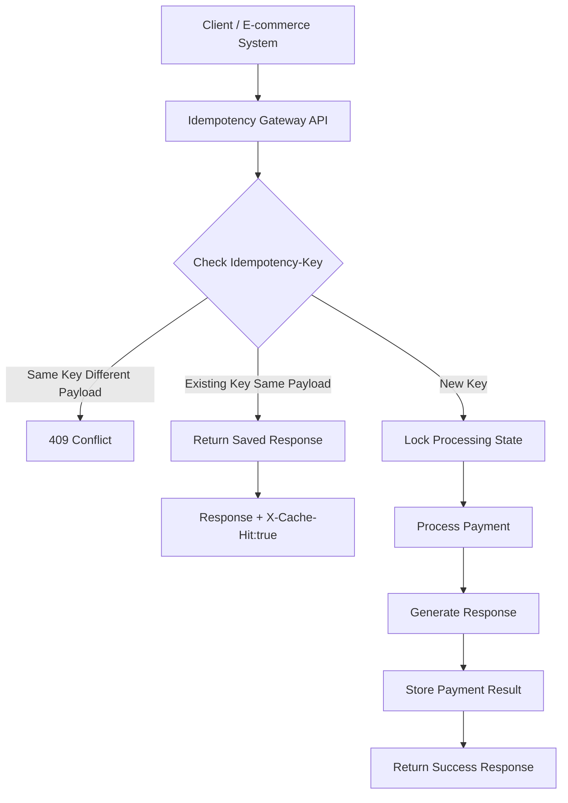
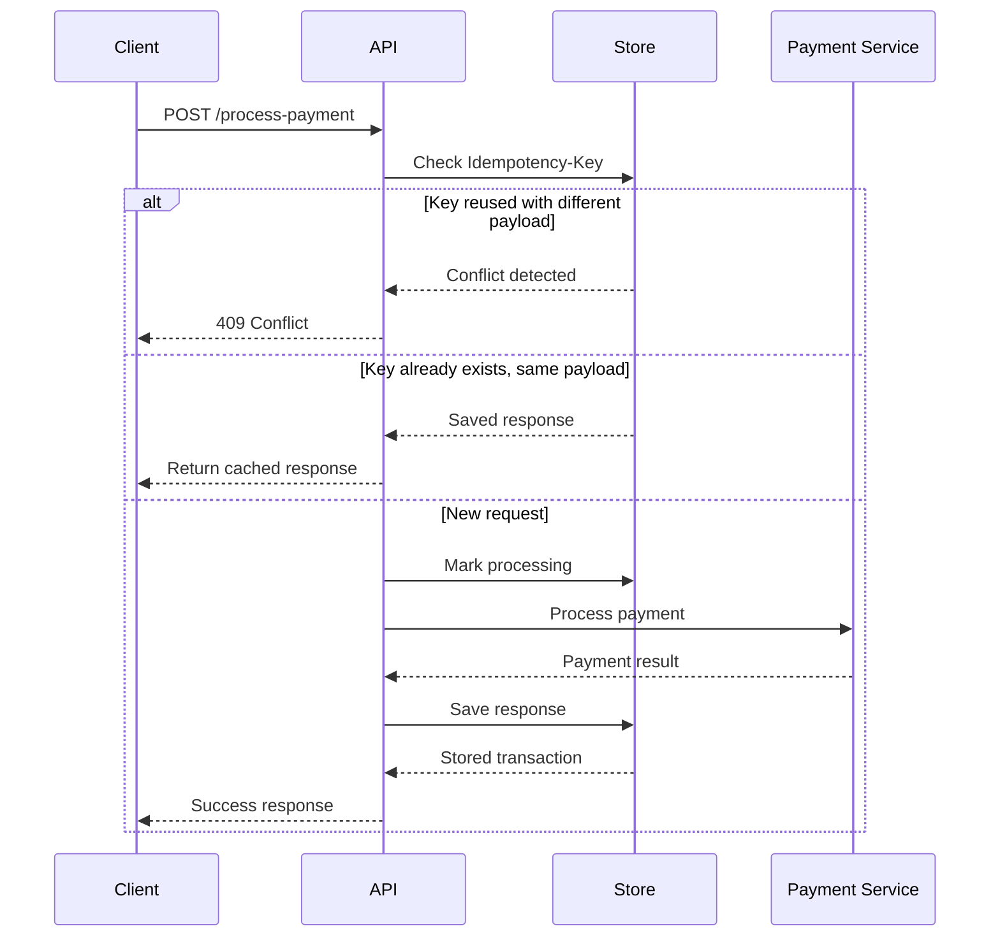

# Idempotency Gateway (Pay-Once Protocol)

A RESTful payment processing API that prevents duplicate transactions using an idempotency key.

This project simulates a payment gateway where a request is processed exactly once, even if the client retries the request due to network failures.

---

## 🌐 Live Demo

* API Base URL: `https://idempotency-gateway-s7v1.onrender.com`
* Swagger UI: `https://idempotency-gateway-s7v1.onrender.com/apidocs/`

> Note: First request may take 30-60 seconds as Render's free tier spins down inactive services after periods of inactivity.

---

# Project Overview

Payment systems can receive duplicate requests when clients retry after timeouts.

The Idempotency Gateway solves this problem by:

* Accepting a unique `Idempotency-Key`
* Processing new payment requests once
* Saving the original response
* Returning the saved response for duplicate requests
* Rejecting reused keys with different payment data

---

# Features

* Idempotent payment processing
* Duplicate payment prevention
* Request payload validation
* Conflict detection
* Concurrent request protection
* Cached response replay
* Swagger UI API testing
* In-memory transaction storage

---

# Architecture Diagram

## Request Flow



---

## Sequence Diagram



---

# Technology Stack

* Python
* Flask
* Flasgger (Swagger UI)
* In-memory storage
* Render (Deployment)

---

# Project Structure

```
Idempotency-Gateway/

│
├── app/
│   ├── __init__.py
│   ├── routes.py
│   ├── store.py
│   ├── models.py
│   ├── service.py
│   └── utils.py
│
├── tests/
│
├── main.py
├── config.py
├── requirements.txt
├── README.md
└── .gitignore
```

---

# Installation

Clone the repository:

```bash
git clone https://github.com/oelshadai/Idempotency-Gateway.git
```

Move into the project folder:

```bash
cd Idempotency-Gateway
```

Create virtual environment:

```bash
python -m venv venv
```

Activate environment:

Windows:

```bash
venv\Scripts\activate
```

Install dependencies:

```bash
pip install -r requirements.txt
```

---

# Running the Application

Start the server:

```bash
python main.py
```

The API runs locally on:

```
http://127.0.0.1:5000
```

The app automatically uses the `PORT` environment variable if set (required for deployment platforms like Render), defaulting to `5000` for local development.

---

# Swagger API Documentation

## Live

```
https://idempotency-gateway-s7v1.onrender.com/apidocs/
```

## Local

```
http://127.0.0.1:5000/apidocs/
```

Swagger UI allows testing the API directly from the browser, including the idempotency replay and conflict detection behavior.

---

# API Documentation

## Process Payment

### Endpoint

```
POST /process-payment
```

---

## Required Headers

```
Content-Type: application/json

Idempotency-Key: unique-payment-key
```

---

## Request Body

Example:

```json
{
  "amount": 100,
  "currency": "GHS"
}
```

---

# First Payment Request

Request:

```
Idempotency-Key: payment123
```

Response:

```json
{
    "status": "success",
    "message": "Charged 100 GHS"
}
```

The payment is processed and the response is stored.

---

# Duplicate Request

Sending the same request again:

```
Idempotency-Key: payment123
```

Response:

```json
{
    "status": "success",
    "message": "Charged 100 GHS"
}
```

Header:

```
X-Cache-Hit: true
```

The payment is not processed again.

---

# Conflict Handling

If the same key is reused with different data:

Request:

```json
{
    "amount": 500,
    "currency": "GHS"
}
```

Using:

```
Idempotency-Key: payment123
```

Response:

```json
{
    "error":
    "Idempotency key already used for a different request body."
}
```

Status:

```
409 Conflict
```

---

# Design Decisions

## In-Memory Storage

A dictionary-based store was used to simulate a fast key-value database.

The store keeps:

* Idempotency key
* Request hash
* Payment response
* Processing state

---

## Request Hashing

Each payment request body is hashed.

This prevents:

* Using the same key for another payment
* Accidental duplicate transactions
* Data inconsistency

---

## Conflict Detection Ordering

Conflict detection is performed **before** the cached-response check.

This ensures that if a previously used Idempotency-Key is sent with a different request body, the API returns a `409 Conflict` immediately — rather than incorrectly replaying a cached response for unrelated data.

---

## Concurrency Handling

The system tracks requests currently being processed.

When two identical requests arrive at the same time:

1. First request starts processing
2. Second request detects the processing state
3. Second request waits
4. First request completes
5. Stored response is returned

This prevents race conditions and double charging.

---

# Developer's Choice Feature

## In-Flight Request Protection

A real payment system can receive multiple retries while the first payment is still processing.

The implemented protection ensures:

* Only one payment process starts
* Other identical requests wait
* The final result is reused

This improves reliability and customer protection.

---

# Testing

The API can be tested using:

* Swagger UI
* Postman
* curl

Test scenarios:

1. First payment request
2. Duplicate request with same key and same payload
3. Same key with a different payload (expects 409 Conflict)
4. Concurrent requests with the same key

---

# Deployment

This application is deployed on **Render** using:

* Build Command: `pip install -r requirements.txt`
* Start Command: `python main.py`
* Environment: Python 3

The app reads the `PORT` environment variable provided by Render at runtime, defaulting to `5000` locally.

---

# Author

Osei Elshadai